# EV Charging Station Management System - Use Case Diagram

## Sơ đồ Use Case Tổng Quan

```mermaid
%%{init: {'theme':'default'}}%%
flowchart TB
    %% ==================== ACTORS ====================
    Driver([Driver<br/>Tài xế])
    Staff([CS Staff<br/>Nhân viên trạm])
    Admin([Admin<br/>Quản trị viên])
    
    %% External System
    PaymentGateway([Payment Gateway<br/>VNPay/MoMo])
    
    %% ==================== SYSTEM BOUNDARY ====================
    subgraph System["EV Charging Station Management System"]
        
        %% ========== DRIVER USE CASES ==========
        subgraph DriverUC[" "]
            direction TB
            
            %% Authentication
            Login[Login<br/>Đăng nhập]
            Register[Register<br/>Đăng ký]
            ForgotPW[Forgot Password<br/>Quên mật khẩu]
            
            %% Profile
            ViewProfile[View Profile<br/>Xem hồ sơ]
            EditProfile[Edit Profile<br/>Sửa hồ sơ]
            UpdateVehicle[Update Vehicle Info<br/>Cập nhật thông tin xe]
            
            %% Station Search
            SearchStation[Search Stations<br/>Tìm trạm sạc]
            ViewMap[View Interactive Map<br/>Xem bản đồ]
            FilterStation[Filter Stations<br/>Lọc trạm sạc]
            ViewStationDetail[View Station Details<br/>Xem chi tiết trạm]
            
            %% Reservation
            CreateReservation[Create Reservation<br/>Đặt chỗ]
            ViewReservation[View Reservations<br/>Xem đặt chỗ]
            CancelReservation[Cancel Reservation<br/>Hủy đặt chỗ]
            ModifyReservation[Modify Reservation<br/>Sửa đặt chỗ]
            
            %% Charging
            StartCharging[Start Charging<br/>Bắt đầu sạc]
            StopCharging[Stop Charging<br/>Dừng sạc]
            MonitorCharging[Monitor Charging<br/>Theo dõi sạc]
            ViewHistory[View Charging History<br/>Xem lịch sử sạc]
            
            %% Payment
            TopUpWallet[Top Up Wallet<br/>Nạp tiền ví]
            PayWallet[Pay with Wallet<br/>Thanh toán ví]
            ViewInvoice[View Invoices<br/>Xem hóa đơn]
            ViewTransactions[View Transactions<br/>Xem giao dịch]
            
            %% Support
            ReportIncident[Report Incident<br/>Báo cáo sự cố]
            RateStation[Rate Station<br/>Đánh giá trạm]
            ReceiveNotification[Receive Notifications<br/>Nhận thông báo]
            ViewAnalytics[View Personal Analytics<br/>Xem thống kê cá nhân]
        end
        
        %% ========== STAFF USE CASES ==========
        subgraph StaffUC[" "]
            direction TB
            
            ManualStart[Manual Start Session<br/>Khởi động sạc thủ công]
            ManualStop[Manual Stop Session<br/>Dừng sạc thủ công]
            MonitorPoints[Monitor Charging Points<br/>Theo dõi điểm sạc]
            
            CashPayment[Record Cash Payment<br/>Ghi nhận thanh toán tiền mặt]
            PrintInvoice[Print Invoice<br/>In hóa đơn]
            
            ViewStationStatus[View Station Status<br/>Xem trạng thái trạm]
            ReportTechnical[Report Technical Issue<br/>Báo cáo sự cố kỹ thuật]
            ViewShift[View Shift Report<br/>Xem báo cáo ca]
            
            CustomerSupport[Customer Support<br/>Hỗ trợ khách hàng]
        end
        
        %% ========== ADMIN USE CASES ==========
        subgraph AdminUC[" "]
            direction TB
            
            %% Station Management
            ManageStation[Manage Stations<br/>Quản lý trạm sạc]
            ManagePoints[Manage Charging Points<br/>Quản lý điểm sạc]
            ControlStation[Remote Control Station<br/>Điều khiển từ xa]
            UpdatePricing[Update Pricing<br/>Cập nhật giá]
            
            %% User Management
            ManageUsers[Manage Users<br/>Quản lý người dùng]
            AssignRole[Assign Roles<br/>Phân quyền]
            ApproveDriver[Approve Driver Profile<br/>Duyệt hồ sơ lái xe]
            LockAccount[Lock/Unlock Account<br/>Khóa/mở tài khoản]
            
            %% Service Management
            CreateSubscription[Create Subscription<br/>Tạo gói thuê bao]
            ManagePricing[Manage Pricing Plans<br/>Quản lý bảng giá]
            CreatePromotion[Create Promotion<br/>Tạo khuyến mãi]
            
            %% Analytics & Reports
            ViewDashboard[View Dashboard<br/>Xem dashboard]
            RevenueReport[Revenue Analytics<br/>Báo cáo doanh thu]
            UsageReport[Usage Statistics<br/>Thống kê sử dụng]
            AIForecast[AI Demand Forecast<br/>Dự báo nhu cầu AI]
            StaffPerformance[Staff Performance<br/>Hiệu suất nhân viên]
            
            %% Incident Management
            ViewIncidents[View Incidents<br/>Xem sự cố]
            AssignIncident[Assign Incident<br/>Phân công xử lý]
            TrackProgress[Track Progress<br/>Theo dõi tiến độ]
        end
        
        %% ========== SHARED/INCLUDED USE CASES ==========
        VerifyEmail{{Verify Email<br/>Xác thực email}}
        CheckAvailability{{Check Availability<br/>Kiểm tra khả dụng}}
        CheckBalance{{Check Balance<br/>Kiểm tra số dư}}
        ScanQR{{Scan QR Code<br/>Quét mã QR}}
        ProcessPayment{{Process Payment<br/>Xử lý thanh toán}}
        SendNotification{{Send Notification<br/>Gửi thông báo}}
        GenerateInvoice{{Generate Invoice<br/>Tạo hóa đơn}}
        
    end
    
    %% ==================== RELATIONSHIPS ====================
    
    %% Driver connections
    Driver --> Login
    Driver --> Register
    Driver --> ForgotPW
    Driver --> ViewProfile
    Driver --> EditProfile
    Driver --> UpdateVehicle
    Driver --> SearchStation
    Driver --> ViewMap
    Driver --> FilterStation
    Driver --> ViewStationDetail
    Driver --> CreateReservation
    Driver --> ViewReservation
    Driver --> CancelReservation
    Driver --> ModifyReservation
    Driver --> StartCharging
    Driver --> StopCharging
    Driver --> MonitorCharging
    Driver --> ViewHistory
    Driver --> TopUpWallet
    Driver --> PayWallet
    Driver --> ViewInvoice
    Driver --> ViewTransactions
    Driver --> ReportIncident
    Driver --> RateStation
    Driver --> ReceiveNotification
    Driver --> ViewAnalytics
    
    %% Staff connections
    Staff --> ManualStart
    Staff --> ManualStop
    Staff --> MonitorPoints
    Staff --> CashPayment
    Staff --> PrintInvoice
    Staff --> ViewStationStatus
    Staff --> ReportTechnical
    Staff --> ViewShift
    Staff --> CustomerSupport
    
    %% Admin connections
    Admin --> ManageStation
    Admin --> ManagePoints
    Admin --> ControlStation
    Admin --> UpdatePricing
    Admin --> ManageUsers
    Admin --> AssignRole
    Admin --> ApproveDriver
    Admin --> LockAccount
    Admin --> CreateSubscription
    Admin --> ManagePricing
    Admin --> CreatePromotion
    Admin --> ViewDashboard
    Admin --> RevenueReport
    Admin --> UsageReport
    Admin --> AIForecast
    Admin --> StaffPerformance
    Admin --> ViewIncidents
    Admin --> AssignIncident
    Admin --> TrackProgress
    
    %% Include relationships (dotted arrows)
    Register -.->|include| VerifyEmail
    Login -.->|extend| ForgotPW
    
    CreateReservation -.->|include| CheckAvailability
    CreateReservation -.->|include| CheckBalance
    
    StartCharging -.->|include| ScanQR
    StartCharging -.->|include| CheckBalance
    StopCharging -.->|include| GenerateInvoice
    
    TopUpWallet -.->|include| ProcessPayment
    PayWallet -.->|include| CheckBalance
    PayWallet -.->|include| ProcessPayment
    
    CashPayment -.->|include| GenerateInvoice
    PrintInvoice -.->|include| GenerateInvoice
    
    ApproveDriver -.->|include| SendNotification
    AssignIncident -.->|include| SendNotification
    
    %% External system connection
    ProcessPayment -.->|use| PaymentGateway
    
    %% Styling
    classDef actorStyle fill:#87CEEB,stroke:#4682B4,stroke-width:3px,color:#000
    classDef ucStyle fill:#87CEEB,stroke:#4682B4,stroke-width:2px,color:#000
    classDef includeStyle fill:#FFE4B5,stroke:#DAA520,stroke-width:2px,color:#000
    classDef systemStyle fill:#F0F0F0,stroke:#333,stroke-width:3px
    
    class Driver,Staff,Admin,PaymentGateway actorStyle
    class Login,Register,ForgotPW,ViewProfile,EditProfile,UpdateVehicle ucStyle
    class SearchStation,ViewMap,FilterStation,ViewStationDetail ucStyle
    class CreateReservation,ViewReservation,CancelReservation,ModifyReservation ucStyle
    class StartCharging,StopCharging,MonitorCharging,ViewHistory ucStyle
    class TopUpWallet,PayWallet,ViewInvoice,ViewTransactions ucStyle
    class ReportIncident,RateStation,ReceiveNotification,ViewAnalytics ucStyle
    class ManualStart,ManualStop,MonitorPoints,CashPayment,PrintInvoice ucStyle
    class ViewStationStatus,ReportTechnical,ViewShift,CustomerSupport ucStyle
    class ManageStation,ManagePoints,ControlStation,UpdatePricing ucStyle
    class ManageUsers,AssignRole,ApproveDriver,LockAccount ucStyle
    class CreateSubscription,ManagePricing,CreatePromotion ucStyle
    class ViewDashboard,RevenueReport,UsageReport,AIForecast,StaffPerformance ucStyle
    class ViewIncidents,AssignIncident,TrackProgress ucStyle
    class VerifyEmail,CheckAvailability,CheckBalance,ScanQR,ProcessPayment,SendNotification,GenerateInvoice includeStyle
```

---

## Phiên bản Đơn giản hơn (Simple Layout)

```mermaid
%%{init: {'theme':'default'}}%%
graph TB
    %% Actors
    Driver([👤 Driver])
    Staff([👷 CS Staff])
    Admin([🔧 Admin])
    
    %% System
    subgraph EV["EV Charging Station Management System"]
        
        %% Driver Use Cases - Top Section
        UC1[Đăng ký/Đăng nhập]
        UC2[Quản lý hồ sơ & xe]
        UC3[Tìm & xem trạm sạc]
        UC4[Đặt chỗ sạc]
        UC5[Bắt đầu/Dừng sạc]
        UC6[Theo dõi tiến trình]
        UC7[Thanh toán & Ví]
        UC8[Xem hóa đơn & lịch sử]
        UC9[Báo cáo & đánh giá]
        UC10[Nhận thông báo]
        
        %% Staff Use Cases - Middle Section
        UC20[Khởi động sạc thủ công]
        UC21[Theo dõi trạm & điểm sạc]
        UC22[Thanh toán tiền mặt]
        UC23[In hóa đơn]
        UC24[Báo cáo sự cố]
        UC25[Hỗ trợ khách hàng]
        
        %% Admin Use Cases - Bottom Section
        UC30[Quản lý trạm sạc]
        UC31[Quản lý điểm sạc]
        UC32[Điều khiển từ xa]
        UC33[Quản lý người dùng]
        UC34[Phân quyền & duyệt hồ sơ]
        UC35[Quản lý gói & bảng giá]
        UC36[Tạo khuyến mãi]
        UC37[Dashboard & báo cáo]
        UC38[Dự báo AI]
        UC39[Quản lý sự cố]
        
        %% Shared/Include
        Verify{{Xác thực Email}}
        CheckAvail{{Kiểm tra khả dụng}}
        CheckBal{{Kiểm tra số dư}}
        QR{{Quét QR}}
        Pay{{Xử lý thanh toán}}
    end
    
    %% Connections
    Driver --> UC1 & UC2 & UC3 & UC4 & UC5 & UC6 & UC7 & UC8 & UC9 & UC10
    Staff --> UC20 & UC21 & UC22 & UC23 & UC24 & UC25
    Admin --> UC30 & UC31 & UC32 & UC33 & UC34 & UC35 & UC36 & UC37 & UC38 & UC39
    
    %% Include relationships
    UC1 -.->|include| Verify
    UC4 -.->|include| CheckAvail
    UC4 -.->|include| CheckBal
    UC5 -.->|include| QR
    UC7 -.->|include| Pay
    
    style Driver fill:#4CAF50,stroke:#2E7D32,stroke-width:3px,color:#fff
    style Staff fill:#2196F3,stroke:#1565C0,stroke-width:3px,color:#fff
    style Admin fill:#F44336,stroke:#C62828,stroke-width:3px,color:#fff
    style Verify,CheckAvail,CheckBal,QR,Pay fill:#FFD54F,stroke:#F57C00,stroke-width:2px
```

---

## Danh sách Use Cases theo Actor

### 🚗 DRIVER (Tài xế) - 24 Use Cases

#### Xác thực & Tài khoản
1. **Login** - Đăng nhập vào hệ thống
2. **Register** - Đăng ký tài khoản mới
3. **Forgot Password** - Quên mật khẩu
4. **View Profile** - Xem hồ sơ cá nhân
5. **Edit Profile** - Sửa thông tin cá nhân
6. **Update Vehicle Info** - Cập nhật thông tin xe

#### Tìm kiếm & Xem trạm sạc
7. **Search Stations** - Tìm kiếm trạm sạc
8. **View Interactive Map** - Xem bản đồ tương tác
9. **Filter Stations** - Lọc trạm theo tiêu chí (vị trí, loại sạc, công suất)
10. **View Station Details** - Xem chi tiết trạm sạc

#### Đặt chỗ
11. **Create Reservation** - Tạo đặt chỗ mới
12. **View Reservations** - Xem danh sách đặt chỗ
13. **Cancel Reservation** - Hủy đặt chỗ
14. **Modify Reservation** - Sửa đổi đặt chỗ

#### Phiên sạc
15. **Start Charging** - Bắt đầu sạc (quét QR)
16. **Stop Charging** - Dừng sạc
17. **Monitor Charging** - Theo dõi tiến trình sạc real-time
18. **View Charging History** - Xem lịch sử sạc

#### Thanh toán & Ví
19. **Top Up Wallet** - Nạp tiền vào ví
20. **Pay with Wallet** - Thanh toán bằng ví
21. **View Invoices** - Xem hóa đơn
22. **View Transactions** - Xem lịch sử giao dịch

#### Hỗ trợ & Phân tích
23. **Report Incident** - Báo cáo sự cố
24. **Rate Station** - Đánh giá trạm sạc
25. **Receive Notifications** - Nhận thông báo
26. **View Personal Analytics** - Xem thống kê cá nhân

---

### 👷 CS STAFF (Nhân viên trạm) - 9 Use Cases

#### Quản lý sạc
27. **Manual Start Session** - Khởi động phiên sạc thủ công
28. **Manual Stop Session** - Dừng phiên sạc
29. **Monitor Charging Points** - Theo dõi trạng thái điểm sạc

#### Thanh toán
30. **Record Cash Payment** - Ghi nhận thanh toán tiền mặt
31. **Print Invoice** - In hóa đơn

#### Giám sát & Hỗ trợ
32. **View Station Status** - Xem tình trạng trạm
33. **Report Technical Issue** - Báo cáo sự cố kỹ thuật
34. **View Shift Report** - Xem báo cáo ca làm việc
35. **Customer Support** - Hỗ trợ khách hàng tại trạm

---

### 🔧 ADMIN (Quản trị viên) - 23 Use Cases

#### Quản lý trạm sạc
36. **Manage Stations** - Quản lý trạm sạc (CRUD)
37. **Manage Charging Points** - Quản lý điểm sạc (CRUD)
38. **Remote Control Station** - Điều khiển trạm từ xa (On/Off)
39. **Update Pricing** - Cập nhật giá sạc

#### Quản lý người dùng
40. **Manage Users** - Quản lý tài khoản người dùng
41. **Assign Roles** - Phân quyền cho nhân viên
42. **Approve Driver Profile** - Xét duyệt hồ sơ lái xe
43. **Lock/Unlock Account** - Khóa/mở khóa tài khoản

#### Quản lý dịch vụ
44. **Create Subscription** - Tạo gói thuê bao
45. **Manage Pricing Plans** - Quản lý bảng giá
46. **Create Promotion** - Tạo chương trình khuyến mãi

#### Báo cáo & Thống kê
47. **View Dashboard** - Xem dashboard tổng quan
48. **Revenue Analytics** - Báo cáo doanh thu theo trạm/khu vực/thời gian
49. **Usage Statistics** - Thống kê tần suất sử dụng trạm
50. **AI Demand Forecast** - Dự báo nhu cầu bằng AI
51. **Staff Performance** - Báo cáo hiệu suất nhân viên

#### Quản lý sự cố
52. **View Incidents** - Xem danh sách sự cố
53. **Assign Incident** - Phân công xử lý sự cố
54. **Track Progress** - Theo dõi tiến độ xử lý

---

## Include & Extend Relationships

### Include (Bắt buộc phải thực hiện)
- **Register → Verify Email**: Đăng ký phải xác thực email
- **Create Reservation → Check Availability**: Đặt chỗ phải kiểm tra khả dụng
- **Create Reservation → Check Balance**: Đặt chỗ phải kiểm tra số dư
- **Start Charging → Scan QR Code**: Bắt đầu sạc phải quét QR
- **Start Charging → Check Balance**: Bắt đầu sạc phải kiểm tra số dư
- **Stop Charging → Generate Invoice**: Dừng sạc phải tạo hóa đơn
- **Pay with Wallet → Process Payment**: Thanh toán phải xử lý payment
- **Top Up Wallet → Process Payment**: Nạp tiền phải xử lý payment
- **Approve Driver → Send Notification**: Duyệt hồ sơ phải gửi thông báo

### Extend (Mở rộng tùy chọn)
- **Login ← Forgot Password**: Quên mật khẩu là mở rộng của đăng nhập
- **Search Stations ← Filter Stations**: Lọc là mở rộng của tìm kiếm
- **View Charging History ← View Personal Analytics**: Thống kê là mở rộng của lịch sử

---

## Mapping với Yêu cầu Đề bài

| Yêu cầu | Use Cases | Trạng thái |
|---------|-----------|------------|
| **1. Driver - Đăng ký & Quản lý tài khoản** | UC 1-6 | ✅ |
| **2. Driver - Đặt chỗ & khởi động phiên sạc** | UC 7-18 | ✅ |
| **3. Driver - Thanh toán & ví điện tử** | UC 19-22 | ✅ |
| **4. Driver - Lịch sử & phân tích cá nhân** | UC 18, 22, 26 | ✅ |
| **5. Staff - Thanh toán tại trạm** | UC 27-31 | ✅ |
| **6. Staff - Theo dõi và báo cáo** | UC 32-35 | ✅ |
| **7. Admin - Quản lý trạm & điểm sạc** | UC 36-39 | ✅ |
| **8. Admin - Quản lý người dùng & gói** | UC 40-46 | ✅ |
| **9. Admin - Báo cáo & thống kê** | UC 47-54 | ✅ |

**✅ TẤT CẢ YÊU CẦU ĐỀ BÀI ĐÃ ĐƯỢC COVER**

---

## Tổng kết

- **Tổng số Use Cases**: 54
- **Driver**: 26 use cases (48%)
- **CS Staff**: 9 use cases (17%)
- **Admin**: 23 use cases (35%)
- **Shared/Include**: 7 use cases

Sơ đồ được thiết kế theo phong cách tương tự Gender Health Care system với:
- Actors rõ ràng ở bên trái
- Use cases được nhóm theo chức năng
- Include/Extend relationships được thể hiện bằng mũi tên đứt nét
- Hệ thống bên ngoài (Payment Gateway) được kết nối
